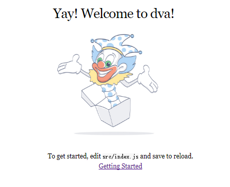
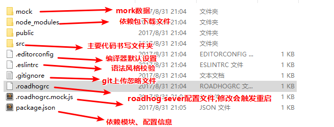
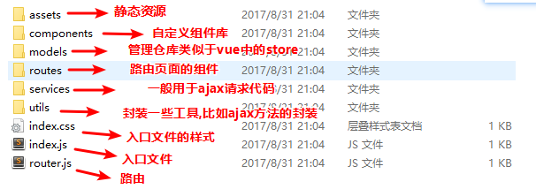

# dva、dva-cli学习小结


## 什么是dva-cli?

- 一个react的脚手架工具,类似于vue-cli

### 怎么使用dva-cli?

```js
# 安装
$ npm install dva-cli -g

# 创建新的app
$ dva new myapp //完整版本的
$ dva new myapp --demo //简单版本的
$ dva new myapp --no-install //不安装依赖的版本
$ dva init //在一个空的文件夹初始化

# 启动app
$ cd myapp
$ npm start
```
- 生成后的网站:<br/>


- 根目录结构:<br/>


- src目录结构:<br/>



## 什么是dva?

- 基于 redux、redux-saga 和 react-router 的轻量级前端框架

- 详见 [Why dva and what's dva ?](https://github.com/dvajs/dva/issues/1)

- 一幅图告诉你什么是dva

 
